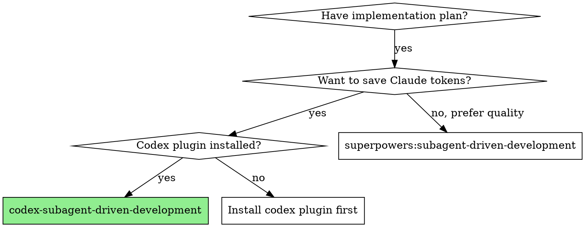

# superpowers-with-codex Implementation Plan

> **For agentic workers:** REQUIRED SUB-SKILL: Use superpowers:subagent-driven-development (recommended) or superpowers:executing-plans to implement this plan task-by-task. Steps use checkbox (`- [ ]`) syntax for tracking.

**Goal:** Claude Code 플러그인으로, 구현 작업을 Codex에 위임하고 Claude가 조율/리뷰를 담당하는 실행 스킬 3개를 제공한다.

**Architecture:** 각 스킬은 독립된 SKILL.md + 프롬프트 템플릿으로 구성. codex-plugin-cc의 `codex-companion.mjs task` 명령으로 Codex에 작업을 위임하고, Claude 서브에이전트로 리뷰를 수행한다.

**Tech Stack:** Claude Code plugin system (SKILL.md frontmatter + markdown), codex-plugin-cc (`codex-companion.mjs`)

**Spec:** `docs/specs/2026-04-03-superpowers-with-codex-design.md`

---

## File Structure

```
superpowers-with-codex/
├── .claude-plugin/
│   └── plugin.json                                    # 플러그인 매니페스트
├── skills/
│   ├── codex-subagent-driven-development/
│   │   ├── SKILL.md                                   # 핵심 실행 스킬: Codex 구현 + Claude 리뷰
│   │   ├── implementer-prompt.md                      # Codex용 구현 프롬프트 템플릿
│   │   └── spec-reviewer-prompt.md                    # Claude용 스펙 리뷰 프롬프트 템플릿
│   ├── codex-executing-plans/
│   │   └── SKILL.md                                   # 간소화 실행 스킬: Codex 구현, 리뷰 없음
│   └── codex-dispatching-parallel-agents/
│       └── SKILL.md                                   # 병렬 실행 스킬: Codex ×N 동시 위임
├── agents/
│   └── code-reviewer.md                               # Claude용 코드 품질 리뷰 에이전트
├── docs/
│   ├── specs/
│   │   └── 2026-04-03-superpowers-with-codex-design.md
│   └── plans/
│       └── 2026-04-03-superpowers-with-codex.md
└── README.md
```

---

### Task 1: Plugin Scaffold

**Files:**
- Create: `.claude-plugin/plugin.json`
- Create: `README.md`

- [ ] **Step 1: Create plugin.json**

```json
{
  "name": "superpowers-with-codex",
  "description": "Superpowers execution skills that delegate implementation to Codex while Claude handles orchestration and review.",
  "version": "0.1.0",
  "author": {
    "name": "leehw",
    "email": ""
  },
  "homepage": "",
  "license": "MIT",
  "keywords": ["superpowers", "codex", "delegation", "code-review", "orchestration"],
  "skills": "./skills/",
  "agents": "./agents/"
}
```

`author.email`과 `homepage`는 GitHub 저장소 생성 후 채운다.

- [ ] **Step 2: Create README.md**

```markdown
# superpowers-with-codex

Superpowers execution skills that delegate implementation to Codex while Claude handles orchestration and review.

## What It Does

Provides Codex-powered alternatives to three superpowers execution skills:

| Skill | Codex Role | Claude Role |
|-------|-----------|-------------|
| codex-subagent-driven-development | Implementation | Orchestration + Spec Review + Code Quality Review |
| codex-executing-plans | Implementation | Orchestration |
| codex-dispatching-parallel-agents | Parallel Implementation | Orchestration + Integration Review |

## Requirements

- [superpowers](https://github.com/obra/superpowers) plugin installed
- [codex-plugin-cc](https://github.com/openai/codex-plugin-cc) plugin installed
- Codex CLI authenticated (`codex login`)

## Installation

```bash
/plugin install <github-url>
```

## Usage

After `superpowers:writing-plans` completes, choose the Codex-powered execution option:

- **codex-subagent-driven-development** — Codex implements, Claude reviews (recommended)
- **codex-executing-plans** — Codex implements, no review loop
- **codex-dispatching-parallel-agents** — parallel independent tasks via Codex
```

- [ ] **Step 3: Commit**

```bash
git add .claude-plugin/plugin.json README.md
git commit -m "feat: add plugin scaffold with manifest and README"
```

---

### Task 2: Codex Implementer Prompt Template

**Files:**
- Create: `skills/codex-subagent-driven-development/implementer-prompt.md`

- [ ] **Step 1: Create implementer-prompt.md**

이 템플릿은 Claude가 태스크 텍스트와 컨텍스트를 채워넣은 후 `codex-companion.mjs task --wait --write` 명령에 전달한다. gpt-5-4-prompting 레시피 블록 구조를 따른다.

```markdown
# Codex Implementer Prompt Template

Claude가 아래 템플릿의 플레이스홀더를 채운 후, 결과 텍스트를 `codex-companion.mjs task --wait --write`의 프롬프트 인자로 전달한다.

## Template

~~~
<task>
You are implementing: {TASK_NAME}

{TASK_DESCRIPTION}

Context: {SCENE_SETTING_CONTEXT}
Working directory: {WORKING_DIRECTORY}
</task>

<default_follow_through_policy>
- Implement exactly what the task specifies. Do not add features, refactoring, or improvements beyond scope.
- Follow existing codebase patterns and conventions.
- If the task specifies TDD, write the failing test first, then implement.
- If something is unclear, report NEEDS_CONTEXT instead of guessing.
- If the task is too complex or you are stuck, report BLOCKED instead of producing bad work.
</default_follow_through_policy>

<verification_loop>
1. Implement the code changes specified in the task.
2. Run all relevant tests. If no test command is specified, look for the project's standard test runner.
3. If tests fail, fix the implementation until tests pass.
4. Commit your work with a descriptive message.
</verification_loop>

<action_safety>
- Only modify files mentioned in the task or directly required by the implementation.
- Do not restructure, rename, or refactor code outside the task scope.
- Do not add dependencies unless the task explicitly requires them.
</action_safety>

<structured_output_contract>
When done, output EXACTLY this format:

STATUS: DONE | DONE_WITH_CONCERNS | BLOCKED | NEEDS_CONTEXT

## Changes
- List each file changed with a one-line description of what changed

## Test Results
- Test command run and pass/fail count

## Concerns
- Any issues, doubts, or observations (omit section if none)

## Blocked Reason
- What you are stuck on and what you need (omit section if not BLOCKED/NEEDS_CONTEXT)
</structured_output_contract>
~~~

## Placeholders

| Placeholder | Description | Filled by |
|---|---|---|
| `{TASK_NAME}` | Task number and name from plan | Claude (main session) |
| `{TASK_DESCRIPTION}` | Full task text from plan, including all steps and code blocks | Claude (main session) |
| `{SCENE_SETTING_CONTEXT}` | Where this task fits in the overall plan, dependencies on prior tasks, architectural context | Claude (main session) |
| `{WORKING_DIRECTORY}` | Absolute path to current working directory | Claude (main session) |
```

- [ ] **Step 2: Commit**

```bash
git add skills/codex-subagent-driven-development/implementer-prompt.md
git commit -m "feat: add Codex implementer prompt template"
```

---

### Task 3: Spec Reviewer Prompt Template

**Files:**
- Create: `skills/codex-subagent-driven-development/spec-reviewer-prompt.md`

- [ ] **Step 1: Create spec-reviewer-prompt.md**

이 템플릿은 superpowers의 spec-reviewer-prompt.md를 기반으로 하되, Codex 위임 컨텍스트에 맞게 조정한다. Claude 서브에이전트가 사용한다.

```markdown
# Spec Compliance Reviewer Prompt Template

Claude 서브에이전트용. Codex가 구현한 코드가 스펙에 맞는지 검증한다.

## Template

~~~
Task tool (general-purpose):
  description: "Review spec compliance for Task N"
  prompt: |
    You are reviewing whether a Codex implementation matches its specification.

    ## What Was Requested

    [FULL TEXT of task requirements from plan]

    ## What Codex Claims It Built

    [From Codex's structured output - the Changes and Test Results sections]

    ## CRITICAL: Do Not Trust the Report

    Codex completed this task autonomously. Its report may be incomplete,
    inaccurate, or optimistic. You MUST verify everything independently.

    **DO NOT:**
    - Take Codex's word for what it implemented
    - Trust claims about completeness
    - Accept its interpretation of requirements

    **DO:**
    - Read the actual code that was written
    - Compare actual implementation to requirements line by line
    - Check for missing pieces claimed as implemented
    - Look for extra features not in spec
    - Verify test coverage matches requirements

    ## Your Job

    Read the implementation code and verify:

    **Missing requirements:**
    - Did Codex implement everything that was requested?
    - Are there requirements it skipped or missed?
    - Did it claim something works but didn't actually implement it?

    **Extra/unneeded work:**
    - Did Codex build things that weren't requested?
    - Did it over-engineer or add unnecessary features?

    **Misunderstandings:**
    - Did Codex interpret requirements differently than intended?
    - Did it solve the wrong problem?

    **Verify by reading code, not by trusting report.**

    Report:
    - ✅ Spec compliant (if everything matches after code inspection)
    - ❌ Issues found: [list specifically what's missing or extra, with file:line references]
~~~
```

- [ ] **Step 2: Commit**

```bash
git add skills/codex-subagent-driven-development/spec-reviewer-prompt.md
git commit -m "feat: add spec compliance reviewer prompt template"
```

---

### Task 4: Code Quality Reviewer Agent

**Files:**
- Create: `agents/code-reviewer.md`

- [ ] **Step 1: Create code-reviewer.md**

superpowers의 code-reviewer.md를 기반으로 하되, Codex 위임 컨텍스트를 반영한다.

```markdown
---
name: code-reviewer
description: |
  Use this agent to review code quality after Codex implementation passes spec compliance review.
  Dispatched by codex-subagent-driven-development skill after spec review passes.
model: inherit
---

You are a Senior Code Reviewer. You are reviewing code that was implemented by Codex (an AI coding agent) and has already passed spec compliance review. Your focus is code quality, not requirements coverage.

When reviewing, check:

1. **Code Quality:**
   - Clean, readable, maintainable code
   - Proper error handling and edge cases
   - Good naming conventions
   - No unnecessary complexity

2. **Architecture:**
   - Each file has one clear responsibility
   - Units can be understood and tested independently
   - Follows existing codebase patterns
   - Proper separation of concerns

3. **Testing:**
   - Tests verify actual behavior, not implementation details
   - Adequate coverage for the changes
   - Tests are readable and maintainable

4. **Safety:**
   - No security vulnerabilities introduced
   - No performance regressions
   - No unintended side effects

5. **Scope:**
   - Implementation stays within task boundaries
   - No unnecessary refactoring or gold-plating
   - Files not mentioned in task are untouched

Categorize issues as:
- **Critical** (must fix): bugs, security issues, data loss risks
- **Important** (should fix): architecture problems, missing tests, poor patterns
- **Minor** (nice to have): style, naming, small optimizations

Output format:
- **Strengths:** What was done well
- **Issues:** Critical/Important/Minor with file:line references
- **Assessment:** APPROVED or NEEDS_CHANGES
```

- [ ] **Step 2: Commit**

```bash
git add agents/code-reviewer.md
git commit -m "feat: add code quality reviewer agent definition"
```

---

### Task 5: codex-subagent-driven-development SKILL.md

**Files:**
- Create: `skills/codex-subagent-driven-development/SKILL.md`

- [ ] **Step 1: Create SKILL.md**

이 스킬은 플러그인의 핵심이다. superpowers의 subagent-driven-development 흐름을 따르되, 구현을 Codex에 위임한다.

```markdown
---
name: codex-subagent-driven-development
description: Use when executing implementation plans with Codex handling implementation and Claude handling review — requires codex plugin installed
---

# Codex Subagent-Driven Development

Execute plan by delegating implementation to Codex, with Claude performing two-stage review after each task: spec compliance first, then code quality.

**Why Codex delegation:** Codex handles the token-heavy implementation work while Claude focuses on orchestration, judgment, and review. This significantly reduces Claude token usage while maintaining review quality.

**Core principle:** Codex implements + Claude reviews = token-efficient, high-quality execution

**Announce at start:** "I'm using codex-subagent-driven-development to execute this plan. Codex will handle implementation, Claude will handle reviews."

## Prerequisite Check

Before starting, verify codex-plugin-cc is available:

1. Run: `Bash(node "${CLAUDE_PLUGIN_ROOT}/../codex/*/plugins/codex/scripts/codex-companion.mjs" setup --json)` or invoke `/codex:setup --json`
2. If Codex is not available:
   - Tell user: "codex plugin is required. Install with: `/plugin install codex@ai-agent-marketplace`"
   - Then run `!codex login` if not authenticated
   - Stop execution

If the prerequisite check itself fails (command not found), the codex plugin is not installed.

## When to Use



## The Process

### Step 1: Load Plan

1. Read plan file
2. Extract all tasks with full text
3. Note context and dependencies between tasks
4. Create TodoWrite with all tasks

### Step 2: Execute Tasks

For each task:

**2a. Prepare Codex prompt**
- Read `implementer-prompt.md` template from this skill's directory
- Fill placeholders:
  - `{TASK_NAME}`: task number and name
  - `{TASK_DESCRIPTION}`: full task text from plan (paste it, don't reference file)
  - `{SCENE_SETTING_CONTEXT}`: where task fits, what prior tasks built, dependencies
  - `{WORKING_DIRECTORY}`: current working directory path

**2b. Dispatch to Codex**
- Run: `Bash(node "<codex-companion-path>" task --wait --write "<filled prompt>")`
- Wait for completion

**2c. Handle Codex result**
- Parse the STATUS line from Codex output:
  - **DONE** → proceed to spec review (2d)
  - **DONE_WITH_CONCERNS** → read concerns, assess severity, proceed to spec review (2d) if acceptable
  - **NEEDS_CONTEXT** → provide missing context, re-dispatch (back to 2a with enriched context)
  - **BLOCKED** → assess blocker:
    1. Context problem → provide more context, re-dispatch
    2. Task too complex → break into smaller pieces
    3. Fundamental issue → escalate to user
- If Codex job status is `failed` → check errorMessage, retry with `--effort medium` or escalate

**2d. Spec compliance review (Claude subagent)**
- Read `spec-reviewer-prompt.md` template
- Fill in task requirements and Codex's report
- Dispatch Claude subagent (Task tool, general-purpose)
- If ✅ Spec compliant → proceed to code quality review (2e)
- If ❌ Issues found:
  - Construct fix prompt with specific issues from reviewer
  - Run: `Bash(node "<codex-companion-path>" task --wait --write --resume "<fix prompt>")`
  - Re-run spec review
  - After 3 failed attempts → escalate to user

**2e. Code quality review (Claude subagent)**
- Dispatch Claude subagent using `agents/code-reviewer.md`
- Provide: what was implemented, task requirements, base SHA, current SHA
- If APPROVED → mark task complete
- If NEEDS_CHANGES:
  - Construct fix prompt with specific issues from reviewer
  - Run: `Bash(node "<codex-companion-path>" task --wait --write --resume "<fix prompt>")`
  - Re-run code quality review
  - After 3 failed attempts → escalate to user

**2f. Mark task complete in TodoWrite**

### Step 3: Complete Development

After all tasks complete:
- **REQUIRED SUB-SKILL:** Use superpowers:finishing-a-development-branch

## Locating codex-companion.mjs

The codex plugin installs to a cache directory. To find `codex-companion.mjs`:

```bash
# Find the codex companion script
find ~/.claude/plugins/cache -name "codex-companion.mjs" -path "*/codex/*/scripts/*" 2>/dev/null | head -1
```

Cache the path at the start of execution to avoid repeated lookups.

## Model Selection for Claude Subagents

- **Spec reviewer:** Use default model (needs judgment about requirement interpretation)
- **Code quality reviewer:** Use default model (needs architectural understanding)

## Red Flags

**Never:**
- Start implementation on main/master branch without explicit user consent
- Skip reviews (spec compliance OR code quality)
- Proceed with unfixed issues
- Dispatch multiple Codex tasks in parallel (use codex-dispatching-parallel-agents for that)
- Skip the prerequisite check
- Ignore Codex's BLOCKED or NEEDS_CONTEXT status
- Accept "close enough" on spec compliance
- Start code quality review before spec compliance passes
- Move to next task while review has open issues

**If Codex reports NEEDS_CONTEXT:**
- Provide the missing context clearly
- Re-dispatch with enriched prompt
- Don't force Codex to guess

**If reviewer finds issues:**
- Codex fixes them via --resume (same thread)
- Reviewer re-reviews
- Repeat until approved or escalate after 3 attempts

## Integration

**Required plugins:**
- **superpowers** — brainstorming, writing-plans, finishing-a-development-branch, using-git-worktrees
- **codex-plugin-cc** — Codex CLI integration

**Superpowers skills used:**
- **superpowers:using-git-worktrees** — REQUIRED: Set up isolated workspace before starting
- **superpowers:writing-plans** — Creates the plan this skill executes
- **superpowers:finishing-a-development-branch** — Complete development after all tasks
```

- [ ] **Step 2: Commit**

```bash
git add skills/codex-subagent-driven-development/SKILL.md
git commit -m "feat: add codex-subagent-driven-development skill"
```

---

### Task 6: codex-executing-plans SKILL.md

**Files:**
- Create: `skills/codex-executing-plans/SKILL.md`

- [ ] **Step 1: Create SKILL.md**

```markdown
---
name: codex-executing-plans
description: Use when you have a written implementation plan and want Codex to handle implementation without review loops — requires codex plugin installed
---

# Codex Executing Plans

Load plan, delegate each task to Codex sequentially, report when complete. No review loops — use codex-subagent-driven-development if you want spec and code quality reviews.

**Announce at start:** "I'm using codex-executing-plans to implement this plan. Codex will handle implementation."

## Prerequisite Check

Before starting, verify codex-plugin-cc is available:

1. Run `/codex:setup --json`
2. If Codex is not available:
   - Tell user: "codex plugin is required. Install with: `/plugin install codex@ai-agent-marketplace`"
   - Stop execution

## When to Use

- You have a written implementation plan
- You want Codex to handle implementation (save Claude tokens)
- You don't need review loops between tasks
- For review loops, use codex-subagent-driven-development instead

## The Process

### Step 1: Load and Review Plan

1. Read plan file
2. Review critically — identify any questions or concerns
3. If concerns: raise them with user before starting
4. If no concerns: create TodoWrite and proceed

### Step 2: Execute Tasks

For each task:

1. Mark as in_progress
2. Prepare Codex prompt:
   - Read `../codex-subagent-driven-development/implementer-prompt.md` template
   - Fill placeholders with task text, context, working directory
3. Dispatch to Codex:
   - Run: `Bash(node "<codex-companion-path>" task --wait --write "<filled prompt>")`
4. Handle result:
   - **DONE / DONE_WITH_CONCERNS** → mark task complete, proceed to next
   - **NEEDS_CONTEXT** → provide context, re-dispatch
   - **BLOCKED** → escalate to user
   - Job `failed` → retry with `--effort medium` or escalate
5. Mark as completed

### Step 3: Complete Development

After all tasks complete:
- **REQUIRED SUB-SKILL:** Use superpowers:finishing-a-development-branch

## When to Stop and Ask for Help

**STOP executing immediately when:**
- Codex reports BLOCKED repeatedly
- Task fails after retry with higher effort
- Plan has critical gaps
- You don't understand an instruction

**Ask for clarification rather than guessing.**

## Red Flags

**Never:**
- Start implementation on main/master branch without explicit user consent
- Skip the prerequisite check
- Ignore Codex's BLOCKED or NEEDS_CONTEXT status
- Force through blockers — stop and ask

## Integration

**Required plugins:**
- **superpowers** — writing-plans, finishing-a-development-branch, using-git-worktrees
- **codex-plugin-cc** — Codex CLI integration
```

- [ ] **Step 2: Commit**

```bash
git add skills/codex-executing-plans/SKILL.md
git commit -m "feat: add codex-executing-plans skill"
```

---

### Task 7: codex-dispatching-parallel-agents SKILL.md

**Files:**
- Create: `skills/codex-dispatching-parallel-agents/SKILL.md`

- [ ] **Step 1: Create SKILL.md**

```markdown
---
name: codex-dispatching-parallel-agents
description: Use when facing 2+ independent tasks that can be delegated to Codex in parallel without shared state or sequential dependencies — requires codex plugin installed
---

# Codex Dispatching Parallel Agents

Dispatch independent tasks to Codex in parallel. Each task runs in its own Codex thread concurrently. Claude coordinates dispatch, monitors progress, and integrates results.

**Core principle:** One Codex task per independent problem domain. Let them work concurrently.

**Announce at start:** "I'm using codex-dispatching-parallel-agents to run N independent tasks via Codex in parallel."

## Prerequisite Check

Before starting, verify codex-plugin-cc is available:

1. Run `/codex:setup --json`
2. If Codex is not available:
   - Tell user: "codex plugin is required. Install with: `/plugin install codex@ai-agent-marketplace`"
   - Stop execution

## When to Use

**Use when:**
- 2+ independent tasks with no shared state
- Each task can be understood without context from others
- Tasks won't edit the same files

**Don't use when:**
- Tasks are related (fix one might fix others)
- Tasks would edit the same files (merge conflicts)
- Need to understand full system state first

## The Process

### 1. Identify Independent Domains

Group work by what's independent:
- Different test files failing for different reasons
- Different subsystems needing fixes
- Different features that don't overlap

### 2. Create Focused Prompts

For each task, prepare a Codex prompt using the implementer-prompt.md template from codex-subagent-driven-development:
- **Specific scope:** one problem domain
- **Clear goal:** what "done" looks like
- **Constraints:** don't change code outside scope
- **Expected output:** structured status report

### 3. Dispatch All in Parallel

For each task:
```bash
node "<codex-companion-path>" task --background --write "<prompt>"
```

All dispatched in rapid succession (not waiting for completion).

### 4. Monitor Progress

Poll for completion:
```bash
node "<codex-companion-path>" status --wait
```

Or check periodically:
```bash
node "<codex-companion-path>" status
```

### 5. Collect Results

For each completed job:
```bash
node "<codex-companion-path>" result <job-id>
```

Parse STATUS from each result.

### 6. Integrate and Verify

Claude reviews all results:
1. **Check for conflicts:** Did any tasks edit the same files?
   - If yes: review the overlapping changes, resolve manually or escalate
2. **Run full test suite:** Verify all changes work together
3. **Spot check:** Review each task's changes for correctness
4. **Report:** Summarize what was done, any issues found

## Error Handling

- If a task fails: note it, continue with others, address failed tasks after
- If multiple tasks edited same file: flag conflict to user
- If test suite fails after integration: investigate which task's changes caused it

## Red Flags

**Never:**
- Dispatch tasks that would edit the same files
- Skip the integration verification step
- Ignore failed tasks
- Start on main/master branch without user consent

## Integration

**Required plugins:**
- **codex-plugin-cc** — Codex CLI integration

**Optional:**
- **superpowers** — for finishing-a-development-branch after all tasks complete
```

- [ ] **Step 2: Commit**

```bash
git add skills/codex-dispatching-parallel-agents/SKILL.md
git commit -m "feat: add codex-dispatching-parallel-agents skill"
```

---

## Self-Review

**Spec coverage:**
- ✅ Plugin structure (Task 1)
- ✅ codex-subagent-driven-development with Codex impl + Claude review (Task 5)
- ✅ codex-executing-plans without review loop (Task 6)
- ✅ codex-dispatching-parallel-agents with parallel dispatch (Task 7)
- ✅ Implementer prompt template with gpt-5-4-prompting structure (Task 2)
- ✅ Spec reviewer prompt for Claude subagent (Task 3)
- ✅ Code quality reviewer agent (Task 4)
- ✅ Prerequisite check in all 3 skills
- ✅ Error handling (DONE/BLOCKED/NEEDS_CONTEXT status, retry, escalation)
- ✅ --resume for fix loops
- ✅ Integration with superpowers workflow

**Placeholder scan:** No TBD/TODO found. All steps contain actual file content.

**Type consistency:** Template placeholders (`{TASK_NAME}`, `{TASK_DESCRIPTION}`, `{SCENE_SETTING_CONTEXT}`, `{WORKING_DIRECTORY}`) consistent across Task 2 and Task 5. Status codes (DONE, DONE_WITH_CONCERNS, BLOCKED, NEEDS_CONTEXT) consistent across all skills.
