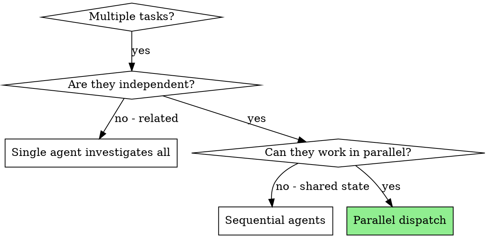

# Dispatching Parallel Agents (Codex-Enhanced)

Dispatch independent tasks in parallel. Supports both Codex-delegated and Claude-native parallel execution. Claude coordinates dispatch, monitors progress, and integrates results.

**Core principle:** One agent per independent problem domain. Let them work concurrently.

**Announce at start:** "I'm using codex-dispatching-parallel-agents to run N independent tasks in parallel."

## Step 0: Execution Mode Selection

Before starting, determine execution mode:

1. Check if Codex is available: Run `/codex:setup --json`
2. **If Codex IS available:**
   - Ask the user: "Codex가 사용 가능합니다. 병렬 실행을 어떤 방식으로 할까요?\n  1. **Codex** — 각 태스크를 Codex에 병렬 위임합니다 (토큰 절약)\n  2. **Claude** — Claude 서브에이전트가 병렬로 처리합니다 (기존 방식)"
   - Wait for user's choice before proceeding
3. **If Codex is NOT available:**
   - Announce: "Codex를 사용할 수 없어 Claude 서브에이전트 방식으로 실행합니다."
   - Proceed with Claude path

## When to Use



**Use when:**
- 2+ independent tasks with no shared state
- Each task can be understood without context from others
- Tasks won't edit the same files

**Don't use when:**
- Tasks are related (fix one might fix others)
- Tasks would edit the same files (merge conflicts)
- Need to understand full system state first

## The Process

### 1. Identify Independent Domains

Group work by what's independent:
- Different test files failing for different reasons
- Different subsystems needing fixes
- Different features that don't overlap

### 2. Create Focused Prompts

For each task:
- **Specific scope:** one problem domain
- **Clear goal:** what "done" looks like
- **Constraints:** don't change code outside scope
- **Expected output:** structured status report

### 3. Dispatch All in Parallel

#### Path A: Codex Dispatch

For each task, prepare a prompt using `../codex-subagent-driven-development/implementer-prompt.md` template:
```bash
node "<codex-companion-path>" task --background --write "<prompt>"
```
All dispatched in rapid succession (not waiting for completion).

#### Path B: Claude Dispatch

For each task, dispatch via Agent tool simultaneously:
```
Agent tool (general-purpose):
  description: "Fix [specific scope]"
  prompt: |
    [Focused task description with all context needed]

    Your task:
    1. Read the relevant code and understand the problem
    2. Identify root cause
    3. Fix the issue
    4. Run tests to verify

    Constraints: Do not change code outside [scope].
    Return: Summary of what you found and what you fixed.
```
All agents dispatched in a single message with multiple tool calls.

### 4. Monitor Progress

**Codex path:**
```bash
node "<codex-companion-path>" status --wait
```

**Claude path:** Agents return results automatically when complete.

### 5. Collect Results

**Codex path:** Parse STATUS from each result via `node "<codex-companion-path>" result <job-id>`

**Claude path:** Read each agent's returned summary.

### 6. Integrate and Verify

1. **Check for conflicts:** Did any tasks edit the same files?
   - If yes: review overlapping changes, resolve manually or escalate
2. **Run full test suite:** Verify all changes work together
3. **Spot check:** Review each task's changes for correctness
4. **Report:** Summarize what was done, any issues found

## Agent Prompt Structure

Good agent prompts are:
1. **Focused** — One clear problem domain
2. **Self-contained** — All context needed to understand the problem
3. **Specific about output** — What should the agent return?

```markdown
Fix the 3 failing tests in src/agents/agent-tool-abort.test.ts:

1. "should abort tool with partial output capture" - expects 'interrupted at' in message
2. "should handle mixed completed and aborted tools" - fast tool aborted instead of completed
3. "should properly track pendingToolCount" - expects 3 results but gets 0

These are timing/race condition issues. Your task:

1. Read the test file and understand what each test verifies
2. Identify root cause - timing issues or actual bugs?
3. Fix by:
   - Replacing arbitrary timeouts with event-based waiting
   - Fixing bugs in abort implementation if found
   - Adjusting test expectations if testing changed behavior

Do NOT just increase timeouts - find the real issue.

Return: Summary of what you found and what you fixed.
```

## Error Handling

- If a task fails: note it, continue with others, address failed tasks after
- If multiple tasks edited same file: flag conflict to user
- If test suite fails after integration: investigate which task's changes caused it

## Common Mistakes

- **Too broad:** "Fix all the tests" — agent gets lost
- **No context:** "Fix the race condition" — agent doesn't know where
- **No constraints:** Agent might refactor everything
- **Vague output:** "Fix it" — you don't know what changed

## Red Flags

**Never:**
- Dispatch tasks that would edit the same files
- Skip the integration verification step
- Ignore failed tasks
- Start on main/master branch without user consent
- Skip the execution mode selection step

## Locating codex-companion.mjs (Codex path only)

```bash
find ~/.claude/plugins/cache -name "codex-companion.mjs" -path "*/codex/*/scripts/*" 2>/dev/null | head -1
```

## Integration

**Required workflow skills (if superpowers plugin installed):**
- **superpowers-with-codex:c-using-git-worktrees** — Set up isolated workspace before starting
- **superpowers-with-codex:c-finishing-a-development-branch** — Complete development after all tasks

**Required for Codex path:**
- **codex plugin** — Codex CLI integration
