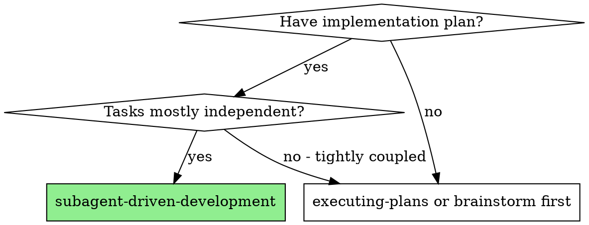

# Subagent-Driven Development (Codex-Enhanced)

Execute plan by dispatching subagents per task, with two-stage review after each: spec compliance first, then code quality. Supports both Codex-delegated and Claude-native execution paths.

**Why subagents:** You delegate tasks to specialized agents with isolated context. By precisely crafting their instructions and context, you ensure they stay focused and succeed at their task. They should never inherit your session's context or history — you construct exactly what they need. This also preserves your own context for coordination work.

**Core principle:** Fresh subagent per task + two-stage review (spec then quality) = high quality, fast iteration

## Step 0: Execution Mode Selection

Before starting, determine execution mode:

1. Check if Codex is available: Run `/codex:setup --json`
2. **If Codex IS available:**
   - Ask the user: "Codex가 사용 가능합니다. 구현을 어떤 방식으로 실행할까요?\n  1. **Codex** — Codex가 구현하고 Claude가 리뷰합니다 (토큰 절약)\n  2. **Claude** — Claude 서브에이전트가 구현과 리뷰를 모두 처리합니다 (기존 방식)"
   - Wait for user's choice before proceeding
3. **If Codex is NOT available:**
   - Announce: "Codex를 사용할 수 없어 Claude 서브에이전트 방식으로 실행합니다."
   - Proceed with Claude path

## When to Use



## The Process

### Step 1: Load Plan

1. Read plan file
2. Extract all tasks with full text
3. Note context and dependencies between tasks
4. Create TodoWrite with all tasks

### Step 2: Execute Tasks

For each task:

**2a. Prepare prompt**

- **Codex path:** Read `implementer-prompt.md` template from this skill's directory. Fill placeholders: `{TASK_NAME}`, `{TASK_DESCRIPTION}`, `{SCENE_SETTING_CONTEXT}`, `{WORKING_DIRECTORY}`
- **Claude path:** Use the implementer subagent prompt template (see Prompt Templates section below)

**2b. Dispatch implementer**

- **Codex path:** Run: `Bash(node "<codex-companion-path>" task --wait --write "<filled prompt>")`
- **Claude path:** Dispatch via Agent tool (general-purpose subagent) with the filled prompt

**2c. Handle implementer result**

Parse the STATUS from output:
- **DONE** → proceed to spec review (2d)
- **DONE_WITH_CONCERNS** → read concerns, assess severity, proceed to spec review (2d) if acceptable
- **NEEDS_CONTEXT** → provide missing context, re-dispatch (back to 2a)
- **BLOCKED** → assess blocker:
  1. Context problem → provide more context, re-dispatch
  2. Task too complex → break into smaller pieces
  3. Fundamental issue → escalate to user
- (Codex path) Job `failed` → retry with `--effort medium` or escalate

**2d. Spec compliance review (Claude subagent)**

- Dispatch Claude subagent with spec reviewer prompt (see Prompt Templates)
- Provide: task requirements + implementer's report
- If spec compliant → proceed to code quality review (2e)
- If issues found:
  - **Codex path:** Run `Bash(node "<codex-companion-path>" task --wait --write --resume "<fix prompt>")`, re-review
  - **Claude path:** Dispatch fix subagent with specific issues, re-review
  - After 3 failed attempts → escalate to user

**2e. Code quality review (Claude subagent)**

- Dispatch Claude subagent using `agents/code-reviewer` agent definition
- Provide: what was implemented, task requirements, base SHA, current SHA
- If APPROVED → mark task complete
- If NEEDS_CHANGES:
  - **Codex path:** Run `Bash(node "<codex-companion-path>" task --wait --write --resume "<fix prompt>")`, re-review
  - **Claude path:** Dispatch fix subagent with specific issues, re-review
  - After 3 failed attempts → escalate to user

**2f. Mark task complete in TodoWrite**

### Step 3: Complete Development

After all tasks complete:
- Dispatch final code reviewer subagent for entire implementation
- **REQUIRED SUB-SKILL:** Use superpowers-with-codex:finishing-a-development-branch (if available)

## Model Selection

**For Claude path subagents:**

Use the least powerful model that can handle each role to conserve cost and increase speed.

- **Mechanical implementation tasks** (isolated functions, clear specs, 1-2 files): use a fast, cheap model
- **Integration and judgment tasks** (multi-file coordination, pattern matching): use a standard model
- **Architecture, design, and review tasks**: use the most capable available model

**For Codex path:**
- **Spec reviewer:** Use default Claude model (needs judgment)
- **Code quality reviewer:** Use default Claude model (needs architectural understanding)

## Handling Implementer Status

**DONE:** Proceed to spec compliance review.

**DONE_WITH_CONCERNS:** Read concerns before proceeding. If about correctness or scope, address first. If observations, note and proceed.

**NEEDS_CONTEXT:** Provide missing context and re-dispatch.

**BLOCKED:** Assess the blocker:
1. Context problem → provide more context, re-dispatch
2. Task requires more reasoning → re-dispatch with more capable model (Claude path) or `--effort medium` (Codex path)
3. Task too large → break into smaller pieces
4. Plan itself is wrong → escalate to human

**Never** ignore an escalation or force retry without changes.

## Prompt Templates

### Implementer Subagent (Claude path)

```
Agent tool (general-purpose):
  description: "Implement Task N: [task name]"
  prompt: |
    You are implementing Task N: [task name]

    ## Task Description
    [FULL TEXT of task from plan - paste it here, don't make subagent read file]

    ## Context
    [Scene-setting: where this fits, dependencies, architectural context]

    ## Before You Begin
    If you have questions about requirements, approach, dependencies, or anything unclear — ask them now.

    ## Your Job
    1. Implement exactly what the task specifies
    2. Write tests (following TDD if task says to)
    3. Verify implementation works
    4. Commit your work
    5. Self-review: completeness, quality, discipline, testing
    6. Report back with: Status (DONE/DONE_WITH_CONCERNS/BLOCKED/NEEDS_CONTEXT), changes, test results, concerns

    Work from: [directory]
```

### Spec Reviewer Subagent

```
Agent tool (general-purpose):
  description: "Review spec compliance for Task N"
  prompt: |
    You are reviewing whether an implementation matches its specification.

    ## What Was Requested
    [FULL TEXT of task requirements]

    ## What Implementer Claims They Built
    [From implementer's report]

    ## CRITICAL: Do Not Trust the Report
    Verify everything independently by reading the actual code.

    Check for:
    - Missing requirements
    - Extra/unneeded work
    - Misunderstandings

    Report:
    - Spec compliant (if everything matches after code inspection)
    - Issues found: [list with file:line references]
```

### Code Quality Reviewer

Uses `agents/code-reviewer` agent definition from this plugin.

## Locating codex-companion.mjs (Codex path only)

```bash
find ~/.claude/plugins/cache -name "codex-companion.mjs" -path "*/codex/*/scripts/*" 2>/dev/null | head -1
```

Cache the path at the start of execution.

## Red Flags

**Never:**
- Start implementation on main/master branch without explicit user consent
- Skip reviews (spec compliance OR code quality)
- Proceed with unfixed issues
- Dispatch multiple implementation subagents in parallel (conflicts) — use codex-dispatching-parallel-agents for that
- Skip the execution mode selection step
- Make subagent read plan file (provide full text instead)
- Skip scene-setting context
- Ignore subagent questions
- Accept "close enough" on spec compliance
- **Start code quality review before spec compliance passes**
- Move to next task while either review has open issues

## Integration

**Required workflow skills (if superpowers plugin installed):**
- **superpowers-with-codex:using-git-worktrees** — REQUIRED: Set up isolated workspace before starting
- **superpowers-with-codex:writing-plans** — Creates the plan this skill executes
- **superpowers-with-codex:requesting-code-review** — Code review template for reviewer subagents
- **superpowers-with-codex:finishing-a-development-branch** — Complete development after all tasks

**Required for Codex path:**
- **codex plugin** — Codex CLI integration

**Subagents should use (if available):**
- **superpowers-with-codex:test-driven-development** — Subagents follow TDD for each task
