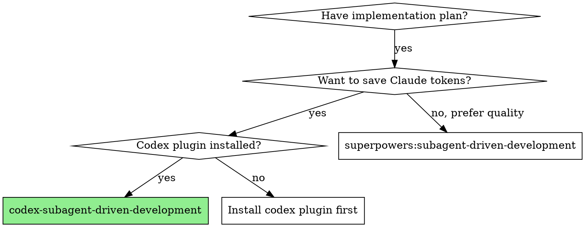

# Codex Subagent-Driven Development

Execute plan by delegating implementation to Codex, with Claude performing two-stage review after each task: spec compliance first, then code quality.

**Why Codex delegation:** Codex handles the token-heavy implementation work while Claude focuses on orchestration, judgment, and review. This significantly reduces Claude token usage while maintaining review quality.

**Core principle:** Codex implements + Claude reviews = token-efficient, high-quality execution

**Announce at start:** "I'm using codex-subagent-driven-development to execute this plan. Codex will handle implementation, Claude will handle reviews."

## Prerequisite Check

Before starting, verify codex-plugin-cc is available:

1. Run `/codex:setup --json`
2. If Codex is not available:
   - Tell user: "codex plugin is required. Install with: `/plugin install codex@ai-agent-marketplace`"
   - Then run `!codex login` if not authenticated
   - Stop execution

If the prerequisite check itself fails (command not found), the codex plugin is not installed.

## When to Use



## The Process

### Step 1: Load Plan

1. Read plan file
2. Extract all tasks with full text
3. Note context and dependencies between tasks
4. Create TodoWrite with all tasks

### Step 2: Execute Tasks

For each task:

**2a. Prepare Codex prompt**
- Read `implementer-prompt.md` template from this skill's directory
- Fill placeholders:
  - `{TASK_NAME}`: task number and name
  - `{TASK_DESCRIPTION}`: full task text from plan (paste it, don't reference file)
  - `{SCENE_SETTING_CONTEXT}`: where task fits, what prior tasks built, dependencies
  - `{WORKING_DIRECTORY}`: current working directory path

**2b. Dispatch to Codex**
- Run: `Bash(node "<codex-companion-path>" task --wait --write "<filled prompt>")`
- Wait for completion

**2c. Handle Codex result**
- Parse the STATUS line from Codex output:
  - **DONE** → proceed to spec review (2d)
  - **DONE_WITH_CONCERNS** → read concerns, assess severity, proceed to spec review (2d) if acceptable
  - **NEEDS_CONTEXT** → provide missing context, re-dispatch (back to 2a with enriched context)
  - **BLOCKED** → assess blocker:
    1. Context problem → provide more context, re-dispatch
    2. Task too complex → break into smaller pieces
    3. Fundamental issue → escalate to user
- If Codex job status is `failed` → check errorMessage, retry with `--effort medium` or escalate

**2d. Spec compliance review (Claude subagent)**
- Read `spec-reviewer-prompt.md` template
- Fill in task requirements and Codex's report
- Dispatch Claude subagent (Task tool, general-purpose)
- If ✅ Spec compliant → proceed to code quality review (2e)
- If ❌ Issues found:
  - Construct fix prompt with specific issues from reviewer
  - Run: `Bash(node "<codex-companion-path>" task --wait --write --resume "<fix prompt>")`
  - Re-run spec review
  - After 3 failed attempts → escalate to user

**2e. Code quality review (Claude subagent)**
- Dispatch Claude subagent using `agents/code-reviewer.md`
- Provide: what was implemented, task requirements, base SHA, current SHA
- If APPROVED → mark task complete
- If NEEDS_CHANGES:
  - Construct fix prompt with specific issues from reviewer
  - Run: `Bash(node "<codex-companion-path>" task --wait --write --resume "<fix prompt>")`
  - Re-run code quality review
  - After 3 failed attempts → escalate to user

**2f. Mark task complete in TodoWrite**

### Step 3: Complete Development

After all tasks complete:
- **REQUIRED SUB-SKILL:** Use superpowers:finishing-a-development-branch

## Locating codex-companion.mjs

The codex plugin installs to a cache directory. To find `codex-companion.mjs`:

```bash
find ~/.claude/plugins/cache -name "codex-companion.mjs" -path "*/codex/*/scripts/*" 2>/dev/null | head -1
```

Cache the path at the start of execution to avoid repeated lookups.

## Model Selection for Claude Subagents

- **Spec reviewer:** Use default model (needs judgment about requirement interpretation)
- **Code quality reviewer:** Use default model (needs architectural understanding)

## Red Flags

**Never:**
- Start implementation on main/master branch without explicit user consent
- Skip reviews (spec compliance OR code quality)
- Proceed with unfixed issues
- Dispatch multiple Codex tasks in parallel (use codex-dispatching-parallel-agents for that)
- Skip the prerequisite check
- Ignore Codex's BLOCKED or NEEDS_CONTEXT status
- Accept "close enough" on spec compliance
- Start code quality review before spec compliance passes
- Move to next task while review has open issues

**If Codex reports NEEDS_CONTEXT:**
- Provide the missing context clearly
- Re-dispatch with enriched prompt
- Don't force Codex to guess

**If reviewer finds issues:**
- Codex fixes them via --resume (same thread)
- Reviewer re-reviews
- Repeat until approved or escalate after 3 attempts

## Integration

**Required plugins:**
- **superpowers** — brainstorming, writing-plans, finishing-a-development-branch, using-git-worktrees
- **codex-plugin-cc** — Codex CLI integration

**Superpowers skills used:**
- **superpowers:using-git-worktrees** — REQUIRED: Set up isolated workspace before starting
- **superpowers:writing-plans** — Creates the plan this skill executes
- **superpowers:finishing-a-development-branch** — Complete development after all tasks
